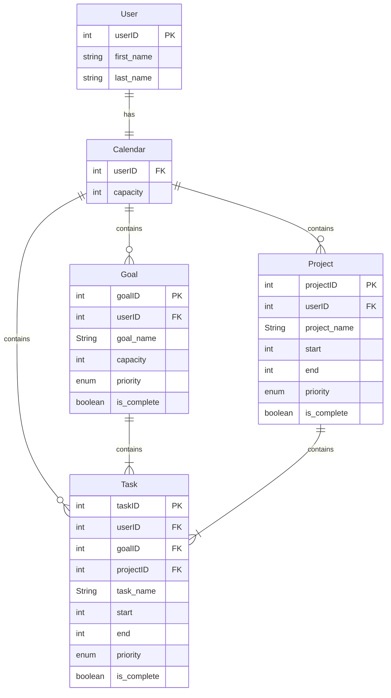
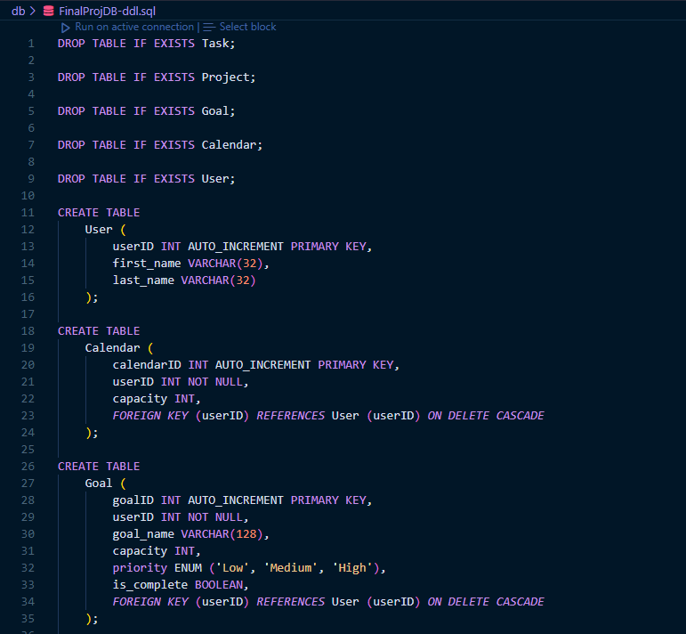
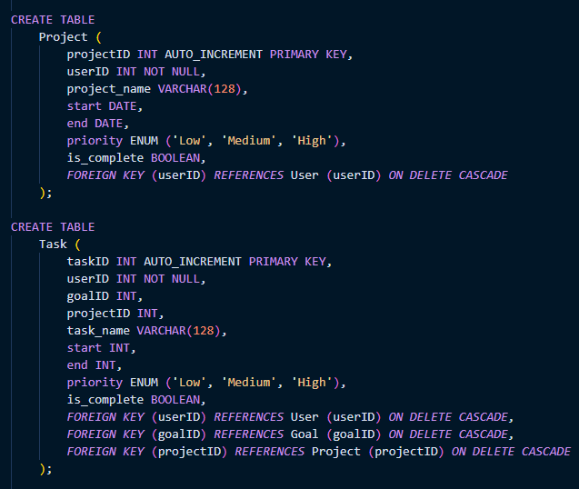
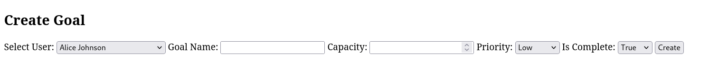
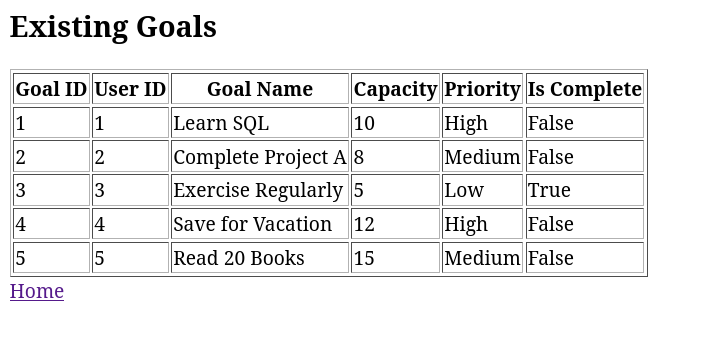
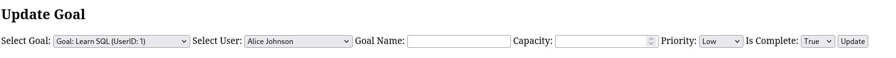
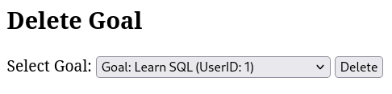

# Time Management Web App

## Overview

A full-stack CRUD-based time-management application that organizes **users**, **tasks**, **goals**, and **projects** using a relational MySQL database. The system provides a multi-page PHP interface with dynamic dropdowns, automatic data reflection, and Dockerized deployment for consistent development across environments.
Developed collaboratively as a two-person project.

## Features

* Multi-entity CRUD operations (Users, Tasks, Goals, Projects, Calendars)
* Relational schema with foreign keys and cascading deletes
* Dashboard overview displaying counts and summaries
* Dynamic UI populated directly from live database content
* Real-time updates as entities are created, modified, or deleted
* Dockerized environment for simple setup and reproducibility

## Tech Stack

* **Frontend/UI:** PHP, HTML/CSS
* **Backend:** PHP
* **Database:** MySQL with phpMyAdmin
* **Deployment:** Docker, Docker Compose
* **Documentation:** Quarto + Mermaid diagrams

## Project Structure

* **/reports** – Quarto documentation, ER diagrams, schema images, and project writeups
* **/images** – UI screenshots and DDL captures
* **/src/db** – DDL file (schema)
* **/src/site** - PHP files for UI pages and CRUD logic
* **/src/docker-compose.yml** – Docker configuration for MySQL, phpMyAdmin, and PHP runtime

## Database Design

### Entity Relationship Diagram



### Relational Schema (DDL)




The database enforces referential integrity using foreign keys linking users to their goals, projects, tasks, and calendars. Cascading behaviors ensure related records remain consistent when entities are updated or removed.

## User Interface

### Overview

This section demonstrates the CRUD (Create, Read, Update, Delete) functionality of the application, using the _Goals_ entity as an example. The same functionality is also applied to _Users_, _Tasks_, _Calendars_, and _Projects_.

#### Create Operation

The **Create** operation allows users to add new goals to their profile. Users can enter necessary information such as the goal name, start and end times, and priority level.



#### Retrieve Operation

The **Retrieve** operation allows users to view all their existing goals. The data is fetched from the database and displayed in a user-friendly manner.



#### Update Operation

Users can update the fields of an existing goal, and changes will automatically cascade down to related tasks. This ensures that all related data stays in sync.



#### Delete Operation

The **Delete** operation allows users to remove goals, and the deletion cascades to related tasks, projects, and goals.



## Running the Application

Make sure Docker is installed, then run:

```bash
docker-compose up
```

After containers start:

* **Web App:** [http://localhost:8081](http://localhost:8081)
* **phpMyAdmin:** [http://localhost:8080](http://localhost:8080)

Stop containers with:

```bash
docker-compose down
```

## Role & Collaboration

Developed collaboratively with a partner. Responsibilities were shared across frontend development, backend CRUD logic, database design, and documentation.

## Additional Material
* **Full Project Documentation (Quarto):** Located in `/reports/`